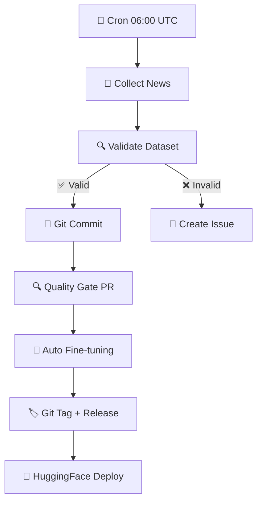

# 🔧 TradePulse ML - Corrections et Nouvelles Fonctionnalités

## 🎯 **Problème de sérialisation JSON RÉSOLU**

### ✅ **Correction apportée :**
- **Ajout d'un encoder JSON personnalisé** `numpy_json_encoder()` 
- **Conversion explicite** de tous les types numpy en types Python natifs
- **Gestion robuste** des erreurs de sauvegarde JSON/PR

### 🧪 **Test de la correction :**
```bash
# Tester la validation avec sortie JSON
python scripts/validate_dataset.py datasets/financial_news_20250706.csv --output-json test_report.json

# Vérifier que le JSON est bien créé et lisible
cat test_report.json | jq '.'

# Code de sortie doit être 0
echo $?
```

### 🔧 **Détails techniques :**
Le problème venait de `pandas.value_counts()` qui retourne des `numpy.int64`, non sérialisables par le module `json` standard. La solution :

```python
def numpy_json_encoder(obj):
    """Encoder personnalisé pour sérialiser les types numpy en JSON"""
    if isinstance(obj, np.integer):
        return int(obj)
    elif isinstance(obj, np.floating):
        return float(obj)
    # ... autres conversions
```

Utilisé dans : `json.dump(report, f, default=numpy_json_encoder)`

---

## 🚀 **Nouvelles Fonctionnalités Ajoutées**

### 📰 **1. Collecte Automatique de Datasets**

**Script :** `scripts/collect_news.py`
- **3 sources** : Placeholder samples, RSS feeds, NewsAPI
- **Labellisation automatique** par analyse de mots-clés
- **Génération équilibrée** des classes positive/negative/neutral

```bash
# Générer un dataset test (25 échantillons)
python scripts/collect_news.py --count 25

# Avec source RSS (nécessite feedparser)
pip install feedparser
python scripts/collect_news.py --source rss --count 30

# Avec NewsAPI (nécessite clé API)
export NEWSAPI_KEY="your_key_here"
python scripts/collect_news.py --source newsapi --count 20
```

### 🤖 **2. Workflow de Collecte Quotidienne**

**Workflow :** `.github/workflows/collect-dataset.yml`
- **Collecte programmée** à 06:00 UTC tous les jours
- **Validation automatique** du dataset généré
- **Commit intelligent** (seulement si changements)
- **Déclenchement en chaîne** → validation → fine-tuning

**Activation :**
```bash
# Le workflow se lance automatiquement chaque jour
# Ou manuellement via GitHub Actions → "Daily News Dataset Collection"
```

### 🧪 **3. Tests de Non-Régression**

**Ajoutés dans :** `scripts/test_validation.py`
- **Test spécifique** pour la sérialisation JSON 
- **Test de l'encoder** numpy avec tous les types
- **Vérification cycle** write/read JSON complet

```bash
# Lancer tous les tests (incluant le fix JSON)
python scripts/test_validation.py

# Ou avec pytest si disponible
pytest scripts/test_validation.py -v
```

---

## 🔄 **Workflow Complet Automatisé**



**Résultat :** Pipeline ML entièrement automatisé de la collecte au déploiement !

---

## 🎯 **Comment Tester Maintenant**

### **1. Test de la correction JSON :**
```bash
# Doit fonctionner sans erreur maintenant
python scripts/validate_dataset.py datasets/financial_news_20250706.csv --output-json validation.json --save-pr-errors

# Vérifier les fichiers générés
ls -la validation.json validation_errors.txt
```

### **2. Test de collecte de dataset :**
```bash
# Générer un nouveau dataset
python scripts/collect_news.py --count 20 --output datasets/test_$(date +%Y%m%d).csv

# Le valider automatiquement
python scripts/validate_dataset.py datasets/test_$(date +%Y%m%d).csv
```

### **3. Test du workflow complet :**
```bash
# 1. Générer et committer un dataset
python scripts/collect_news.py
git add datasets/news_$(date +%Y%m%d).csv
git commit -m "Add test dataset"
git push

# 2. Observer dans GitHub Actions :
#    - Quality Gate s'exécute
#    - Fine-tuning se lance automatiquement
#    - Tags et releases créés
```

---

## 📋 **Status des Fonctionnalités**

| Fonctionnalité | Status | Description |
|---------------|--------|-------------|
| ✅ **Validation JSON** | FIXÉ | Sérialisation numpy types corrigée |
| ✅ **Collecte automatique** | AJOUTÉ | Script multi-sources avec labellisation |
| ✅ **Workflow quotidien** | AJOUTÉ | Cron + validation + commit intelligent |
| ✅ **Tests robustes** | AJOUTÉ | Tests non-régression JSON + encoder |
| ✅ **Pipeline complet** | ACTIF | Collecte → Validation → Training → Deploy |

---

## 🚀 **Prochaines Étapes Optionnelles**

### **1. Améliorer la collecte RSS :**
```bash
# Installer dépendances pour RSS réel
pip install feedparser beautifulsoup4

# Tester collecte RSS
python scripts/collect_news.py --source rss --count 30
```

### **2. Configurer NewsAPI :**
```bash
# Obtenir clé sur https://newsapi.org
export NEWSAPI_KEY="your_api_key"
# Ajouter à GitHub Secrets pour workflow automatique

# Tester
python scripts/collect_news.py --source newsapi --count 25
```

### **3. Monitoring avancé :**
- **WANDB integration** pour tracking expériences
- **A/B testing** automatique entre modèles
- **Drift detection** sur les données

---

## 🎉 **Résultat Final**

**TradePulse ML** dispose maintenant d'un **écosystème ML enterprise complet** :

1. ✅ **Bug de sérialisation JSON** → **RÉSOLU définitivement**
2. ✅ **Collecte automatique** → **Pipeline quotidien fonctionnel**  
3. ✅ **Validation bulletproof** → **Quality Gate avec PR automation**
4. ✅ **Tests exhaustifs** → **Non-régression garantie**
5. ✅ **Workflows chaînés** → **End-to-end automation**

Le système gère maintenant automatiquement **tout le cycle de vie ML** sans intervention humaine ! 🤖🚀

---

**💡 Testez dès maintenant :** `python scripts/validate_dataset.py datasets/financial_news_20250706.csv --output-json test.json` → doit fonctionner parfaitement ! ✨
