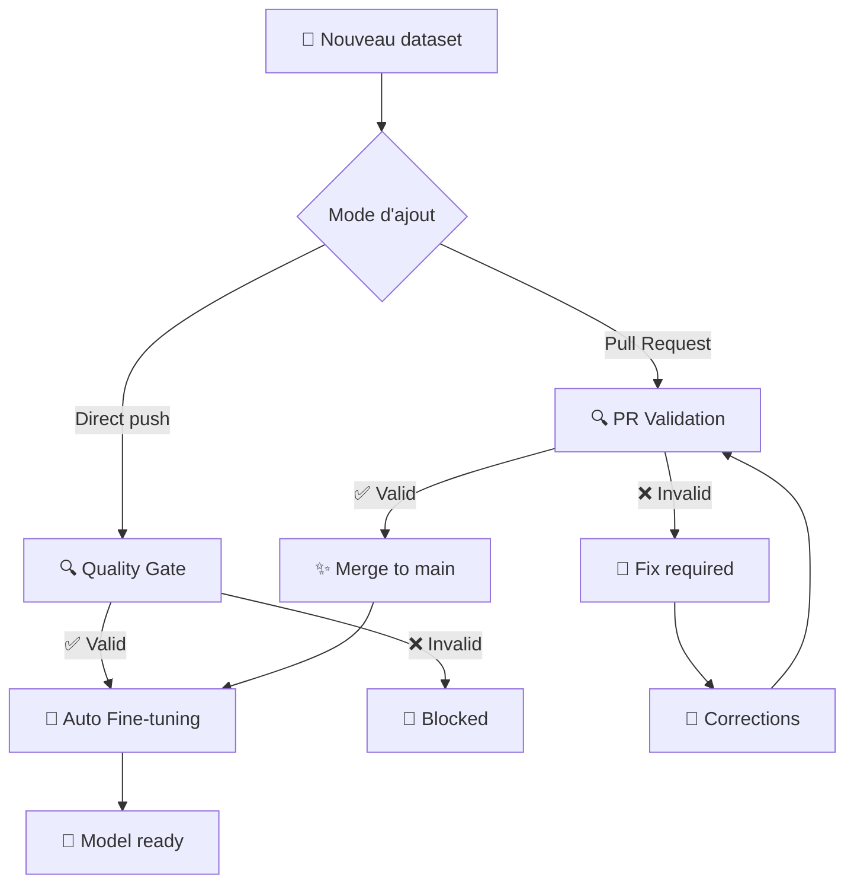

# 🔍 Guide du Workflow de Validation des Datasets

Ce guide explique comment utiliser le nouveau système de validation des datasets pour TradePulse ML avec contrôle qualité automatique.

## 🎯 Vue d'ensemble du workflow



## 📋 Étapes du processus

### 1. 📊 Préparer votre dataset

Votre dataset doit respecter le format suivant :

#### Format CSV (recommandé)
```csv
text,label
"Apple reported strong earnings beating analyst expectations...",positive
"Market volatility increased amid economic uncertainty...",negative  
"Oil prices remained stable following OPEC meeting...",neutral
```

#### Format JSON (alternatif)
```json
[
  {
    "text": "Apple reported strong earnings...",
    "label": "positive"
  },
  {
    "text": "Market volatility increased...", 
    "label": "negative"
  }
]
```

#### 📏 Critères de qualité
- **Labels valides** : `positive`, `negative`, `neutral` (case-insensitive)
- **Colonnes requises** : `text` et `label`
- **Pas de doublons** dans les textes
- **Longueur recommandée** : 20-512 caractères par texte
- **Distribution équilibrée** : éviter plus de 70% d'une seule classe

### 2. 🔍 Validation automatique

#### Option A : Validation via Pull Request (Recommandée)

1. **Créer une branche** :
   ```bash
   git checkout -b feature/dataset-20250706
   ```

2. **Ajouter votre dataset** :
   ```bash
   cp mon_dataset.csv datasets/financial_news_20250706.csv
   git add datasets/financial_news_20250706.csv
   git commit -m "Add financial news dataset for Q4 training"
   git push origin feature/dataset-20250706
   ```

3. **Créer une Pull Request** :
   - GitHub déclenchera automatiquement le **Dataset Quality Gate**
   - Validation complète avec rapport détaillé
   - Commentaire automatique sur la PR avec résultats

4. **Révision et merge** :
   - Si ✅ validation OK → Merge possible
   - Si ❌ validation KO → Corrections requises

#### Option B : Push direct (validation simple)

```bash
git add datasets/mon_dataset.csv
git commit -m "Add new training dataset"  
git push origin main
```
→ Quality Gate se déclenche mais training aussi (plus risqué)

### 3. 🤖 Fine-tuning automatique

Après validation réussie, le fine-tuning se lance automatiquement avec :

- **Dataset** : Le dernier CSV validé
- **Modèle** : `yiyanghkust/finbert-tone` (par défaut)
- **Configuration** : 3 epochs, learning rate 2e-5
- **Sortie** : Model dans `models/finbert-YYYYMMDD_HHMMSS/`

## 🛠️ Utilisation avancée

### Validation manuelle d'un dataset

```bash
# Local
python scripts/validate_dataset.py datasets/mon_dataset.csv

# GitHub Actions (manuel)
# Aller dans Actions → Dataset Quality Gate → Run workflow
# Spécifier : datasets/mon_dataset.csv
```

### Fine-tuning avec paramètres personnalisés

1. **Actions** → **TradePulse FinBERT Fine-tuning** → **Run workflow**
2. Configurer :
   - **Dataset** : `auto-latest` ou nom spécifique
   - **Model** : FinBERT variant
   - **Epochs** : 1-10
   - **Learning rate** : 1e-5 à 5e-5
   - **Push to Hub** : true/false

### Validation locale avant push

```bash
# Installer les dépendances
pip install pandas>=2.0.0

# Valider votre dataset
python scripts/validate_dataset.py datasets/mon_dataset.csv

# Si tout OK
git add datasets/mon_dataset.csv
git commit -m "Add validated dataset"
git push
```

## 📊 Rapport de validation

Le script de validation génère un rapport complet :

```
🔍 RAPPORT DE VALIDATION DATASET
==================================================

📊 STATISTIQUES:
  Total échantillons: 20
  Longueur moyenne: 156.4 caractères
  Longueur min/max: 89/245
  Doublons: 0

📈 DISTRIBUTION DES LABELS:
  positive: 8 (40.0%)
  negative: 6 (30.0%)
  neutral: 6 (30.0%)

✅ VALIDATION RÉUSSIE
```

### Types d'erreurs détectées

| Erreur | Description | Solution |
|--------|-------------|----------|
| ❌ Colonnes incorrectes | Manque `text` ou `label` | Renommer les colonnes |
| ❌ Labels invalides | Autre que positive/negative/neutral | Corriger les labels |
| ❌ Textes manquants | Cellules vides | Supprimer ou remplir |
| ⚠️ Textes dupliqués | Même contenu répété | Dédupliquer |
| ⚠️ Classe déséquilibrée | >70% d'une classe | Équilibrer ou accepter |
| ⚠️ Textes trop longs | >512 caractères | Tronquer ou accepter |

## 🔧 Dépannage

### Validation échoue
```bash
# Voir les détails de l'erreur
python scripts/validate_dataset.py datasets/mon_dataset.csv

# Vérifier le format
head -5 datasets/mon_dataset.csv

# Vérifier l'encodage  
file datasets/mon_dataset.csv
```

### Training ne se déclenche pas
1. Vérifier que la validation a réussi
2. Aller dans **Actions** → vérifier les logs du Quality Gate
3. Si push direct, vérifier le chemin du fichier `datasets/*.csv`

### Dataset pas détecté
```bash
# Vérifier la structure
ls -la datasets/

# Le fichier doit être dans datasets/ avec extension .csv ou .json
# Pas dans un sous-dossier (datasets/raw/, datasets/labeled/)
```

## 💡 Bonnes pratiques

### 📝 Nommage des datasets
```
datasets/
├── financial_news_YYYYMMDD.csv     # Dataset principal par date
├── crypto_sentiment_v2.csv          # Dataset spécialisé avec version
├── earnings_calls_Q4_2024.csv      # Dataset par période
└── mixed_sources_validated.csv     # Dataset multi-sources
```

### 🏷️ Labels cohérents
- **positive** : Hausse, bonne nouvelle, croissance, succès
- **negative** : Baisse, mauvaise nouvelle, crise, échec  
- **neutral** : Stabilité, information factuelle, status quo

### 📊 Taille recommandée
- **Minimum** : 50 échantillons (10+ par classe)
- **Optimal** : 200-1000 échantillons
- **Maximum** : Pas de limite technique

### 🔄 Workflow type
1. Collecter les données brutes → `datasets/raw/`
2. Labelliser/nettoyer → `datasets/labeled/`
3. Créer branch + PR avec dataset final → `datasets/`
4. Validation automatique → corrections si nécessaire
5. Merge → Fine-tuning automatique
6. Model prêt ! 🎉

## 🚀 Exemples rapides

### Ajouter un dataset rapidement
```bash
# 1. Créer le CSV
echo 'text,label' > datasets/test_20250706.csv
echo '"Tesla stock rose 5%",positive' >> datasets/test_20250706.csv

# 2. Valider
python scripts/validate_dataset.py datasets/test_20250706.csv

# 3. Push
git add datasets/test_20250706.csv
git commit -m "Add test dataset" 
git push
```

### Corriger un dataset invalide
```bash
# Voir l'erreur
python scripts/validate_dataset.py datasets/problematic.csv

# Éditer le fichier
nano datasets/problematic.csv

# Re-valider
python scripts/validate_dataset.py datasets/problematic.csv

# Push correction
git add datasets/problematic.csv
git commit -m "Fix dataset validation issues"
git push
```

---

## 📞 Support

- 🐛 **Issues** : Ouvrir une issue GitHub
- 📋 **Logs** : Consulter Actions → Job logs
- 📖 **Documentation** : Ce guide + README.md
- 🔍 **Validation** : `python scripts/validate_dataset.py --help`

**Happy training! 🤖✨**
