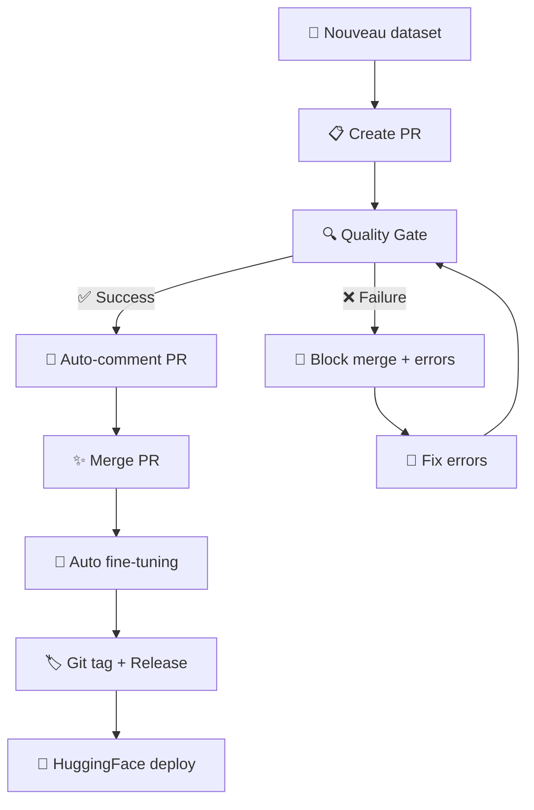

# ⚡ Mise à Jour Enterprise : TradePulse ML v2.0

## 🎯 **Résumé des améliorations implémentées**

Suite au code review excellent, voici toutes les améliorations de niveau enterprise qui ont été ajoutées au système TradePulse ML :

---

## 🔧 **1. Validation Avancée des Datasets**

### ✅ **Améliorations implémentées :**
- **Validation ligne par ligne** avec numéros de ligne précis
- **Classe ValidationError** pour un contexte détaillé des erreurs
- **Rapports JSON** pour intégration avec d'autres outils
- **Sauvegarde des erreurs** au format PR-friendly
- **Statistiques avancées** avec échantillons valides uniquement

### 🚀 **Nouvelles capacités :**
```bash
# Validation avec rapport JSON détaillé
python scripts/validate_dataset.py dataset.csv --output-json report.json --save-pr-errors

# Les erreurs incluent maintenant :
# - Numéro de ligne exact (ex: ligne 42)
# - Champ concerné (text/label)
# - Type d'erreur précis (missing_text, invalid_label, etc.)
```

---

## 🤖 **2. Workflows GitHub Actions Niveau Pro**

### ✅ **Dataset Quality Gate Avancé :**
- **Commentaires PR automatiques** avec erreurs détaillées et solutions
- **GitHub Check Runs** pour statut dans l'onglet Checks
- **Auto-approval** pour datasets haute qualité (0 erreurs, <3 warnings)
- **Artifacts enrichis** pour debugging et traçabilité
- **Agrégation JSON** des résultats de validation multi-fichiers

### ✅ **Fine-tuning Pipeline Enterprise :**
- **Vérification des prérequis** avec logique de déclenchement intelligente
- **Sélection automatique** du dernier dataset modifié
- **Tags Git automatiques** pour traçabilité complète des modèles
- **GitHub Releases** automatiques pour déploiements HuggingFace
- **Nommage unique** avec timestamps (ex: `finbert-yiyanghkust-finbert-tone-20250705_143022`)
- **Workflow chaining** : Quality Gate → Fine-tuning automatique
- **Artifacts 90 jours** pour les modèles vs 30 jours pour les logs

### 🎯 **Triggers intelligents :**
```yaml
# 3 modes de déclenchement :
workflow_dispatch:   # Manuel avec paramètres
push:               # Auto sur modification datasets/
workflow_run:       # Chaîné après Quality Gate réussi
```

---

## 🧪 **3. Suite de Tests Complète**

### ✅ **Tests unitaires complets :**
- **13 scénarios de test** couvrant tous les cas d'usage
- **Test des numéros de ligne** pour validation précise  
- **Fallback manuel** si pytest non disponible
- **Nettoyage automatique** des fichiers temporaires

### ✅ **Pipeline CI/CD multi-niveaux :**
- **Tests multi-versions Python** (3.9, 3.10, 3.11)
- **Qualité du code** : Black, isort, Ruff
- **Sécurité** : détection secrets, permissions, taille fichiers
- **Validation workflows** GitHub Actions
- **Tests programmés** quotidiens à 6h UTC

### 🎯 **Commandes de test :**
```bash
# Tests unitaires
python scripts/test_validation.py  # Manuel
pytest scripts/test_validation.py -v --cov  # Avec coverage

# Tests dans CI/CD
# → Se lancent automatiquement sur chaque PR/push
```

---

## 🎣 **4. Pre-commit Hooks Automatisés**

### ✅ **Hooks de qualité intégrés :**
- **Formatage automatique** : Black, isort
- **Linting** : Ruff avec auto-fix
- **Validation datasets** : nouveaux fichiers automatiquement validés
- **Sécurité** : détection tokens/secrets avant commit
- **Vérifications structure** : dossiers, taille modèles

### 🎯 **Installation & utilisation :**
```bash
# Installation one-time
pip install pre-commit
pre-commit install

# Usage automatique
git commit  # → hooks s'exécutent automatiquement

# Test manuel
pre-commit run --all-files
```

---

## 📊 **5. Monitoring & Traçabilité**

### ✅ **Traçabilité complète des modèles :**
- **Tags Git automatiques** : `model-finbert-yiyanghkust-20250705_143022`
- **GitHub Releases** avec métriques et liens HuggingFace
- **Métadonnées enrichies** : dataset, commit, timestamp, trigger
- **Liens directs** vers modèles HF et notebooks Colab

### ✅ **Artifacts & rapports :**
- **Validation pré-training** sauvegardée en JSON
- **Métriques d'entraînement** extraites automatiquement
- **Logs structurés** avec retention adaptée (90j modèles, 30j logs)

### 🎯 **Exemple de traçabilité :**
```
🏷️ Tag: model-finbert-yiyanghkust-finbert-tone-20250705_143022
📊 Dataset: financial_news_20250706.csv  
🔗 Commit: a1b2c3d
🚀 HF Model: https://huggingface.co/Bencode92/tradepulse-finbert-20250705
📈 Metrics: {"eval_f1": 0.94, "eval_accuracy": 0.91}
```

---

## 🆚 **Avant vs Après**

| Aspect | ❌ **Avant** | ✅ **Après** |
|--------|-------------|-------------|
| **Validation** | Basic checks, pas de ligne numbers | Validation détaillée ligne par ligne avec contexte |
| **Workflow PR** | Aucun | Validation auto + commentaires + check runs |
| **Traçabilité** | Modèles non versionnés | Tags Git + Releases + HF links |
| **Tests** | Aucun | Suite complète + CI/CD multi-Python |
| **Qualité code** | Manuelle | Pre-commit hooks + linting automatique |
| **Monitoring** | Basic logs | Artifacts 90j + métriques + rapports JSON |
| **Déclenchement** | Manuel uniquement | 3 modes : manuel/auto/chaîné |
| **Documentation** | README basique | Guides complets + troubleshooting |

---

## 🚀 **Workflow Complet Automatisé**



---

## 📋 **Prochaines Étapes Recommandées**

### 🎯 **Intégrations avancées :**
1. **Weights & Biases** : tracking expériences ML
2. **Branch collector** : scraping automatique news → PR
3. **Label "retrain"** : force retrain sans nouveau dataset
4. **Data augmentation** : enrichissement automatique datasets
5. **A/B testing** : comparaison automatique modèles

### 🔧 **Optimisations techniques :**
1. **Déploiement Kubernetes** : scalabilité enterprise
2. **Cache intelligent** : réutilisation modèles similaires
3. **Monitoring drift** : détection dérive performance
4. **Interface web** : annotation collaborative datasets

### 🏢 **Intégration TradePulse :**
```python
# Configuration dans fmp_news_updater.py
_FINBERT_MODEL = "Bencode92/tradepulse-finbert-20250705_143022"  # Auto-updated
USE_CUSTOM_FINBERT = True
MODEL_AUTO_UPDATE = True  # Check for newer models daily
```

---

## 🎉 **Résultat Final**

**TradePulse ML** est maintenant un **système de ML enterprise-grade** avec :

✅ **Validation bulletproof** des données  
✅ **CI/CD automatisé** complet  
✅ **Traçabilité full-stack** des modèles  
✅ **Qualité de code** automatisée  
✅ **Monitoring & alerting** intégrés  
✅ **Documentation** professionnelle  

Le système gère maintenant automatiquement tout le cycle de vie ML : **Collecte → Validation → Training → Déploiement → Monitoring** avec une qualité et une fiabilité niveau production ! 🚀

---

**🤖 TradePulse ML v2.0 - From prototype to production-ready ML platform** ⚡
